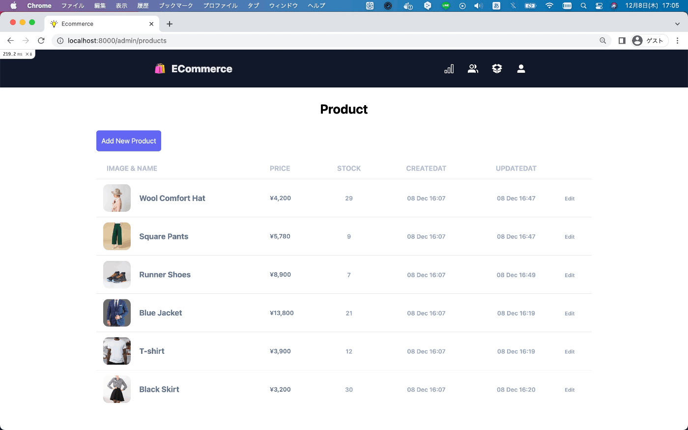
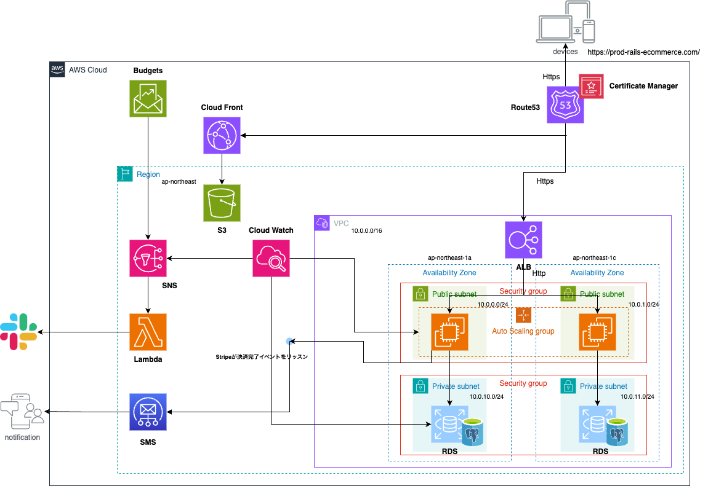

<p align="center">
    
</p>

<p align="center">


</p>

# Rails Ecommerce Application 🛍

### Admin Sample Page 👨‍🏫

<p align="center">
    
</p>

### Customer Sample Page 🛒

<p align="center">
    
</p>

### Add Gem package 📦

<details>
  <summary>Using package list</summary>

- [devise * ユーザー認証](https://github.com/heartcombo/devise)
- [stripe * Stripe決済](https://github.com/stripe/stripe-ruby)
- [aws-sdk-s3 * AWS S3 SDK](https://github.com/aws/aws-sdk-ruby)
- [bullet * N+1の通知](https://github.com/flyerhzm/bullet)
- [rspec-rails * テストフレームワーク]()
- [factory_bot_rails * ユーザー認証]()
- [capybara * システムテスト用]()
- [selenium-webdriver * システムテスト用]()
- [shoulda-matchers * モデルテストの記述省略]()
- [rubocop * 自動フォーマット]()
- [yard * ドキュメント生成]()
- [capistrano * デプロイ用]()

</details>

### Add Node Modules 📦

<details>
  <summary>Using module list</summary>

- [tailwindcss * CSSフレームワーク]()
</details>

### teaching materials link 📚

https://zenn.dev/farstep/books/7f169cdc597ada

# Directory Structure 📁

```
├── .github/
│   ├── workflows/              # Github Actions configuration files

├── app/
│   ├── controllers/            # Contains controller files for the application logic
│   ├── models/                 # Includes model files representing the data structures
│   ├── views/                  # Holds view templates for rendering web pages
│   ├── services/               # Houses service classes and modules

├── config/
│   ├── routes.rb               # Defines the application's routing configuration
│   ├── credentials.yml.enc     # File for storing confidential information (e.g., API keys)

├── db/                         # Contains database schema and migration files

├── docs/                       # Stores documentation files for the project

├── spec/
│   ├── models/                 # Contains RSpec tests for models
│   ├── modules/                # Contains RSpec tests for modules
│   ├── requests/               # Contains RSpec tests for request/response handling
│   ├── support/                # Holds support files for RSpec configuration
│   ├── system/                 # Includes RSpec tests for system-level functionality

├── Capfile                     # Configuration file for Capfile
├── .rspec                      # Configuration file for RSpec test suite
├── .rubocop.yml                # Configuration file for the RuboCop code analyzer
├── docker-compose.yml          # Configuration file for Docker Compose
├── Dockerfile                  # Docker container build instructions
├── Gemfile                     # Lists project dependencies in RubyGems format
├── Gemfile.lock                # Lock file specifying exact dependency versions
├── yarn.lock                   # Lock file for Yarn package manager
```

# Infrastructure

<p align="center">
    
</p>

# DB Structure

Creating... 📝

# Participation in Projects

### `.env`

create .env file to copy .env.example file.

```sh
cp .env.example .env
```

update .env file content in your environment

```dotenv
export COMPOSE_PROJECT_NAME=ecommerce
export POSTGRES_DB=ecommerce

THOR_SILENCE_DEPRECATION=true
```

Create aws credential file 🔑

```sh
# Select your ide "code" 
EDITOR="code --wait" rails credentials:edit
```

### `rails`

```sh
# run migration
rails db:migrate
```

# Command

### `Docker`

#### Build everything:

```sh
docker-compose build --no-cache
```

#### Access to Docker application containers

```sh
docker-compose run --rm web bash
```

#### Stopping everything:

```sh
docker-compose down
```

### `Bundle`

```sh
# install gems
bundle install
# add annotate comment to model file
bundle exec annotate --models 
```

### `rubocop`

```sh
# Static analysis command
rubocop
# Auto fix command
rubocop --auto-correct-all
```

### `rspec`

```sh
# Run all test file
bundle exec rspec
# Run select test file
bundle exec rspec spec/system/
```

### `yard`

```sh
bundle exec yard
bundle bundle exec yard server
```

### `stripe`

```sh
# build stripe webhook server
stripe listen --forward-to localhost:8000/webhooks
```

### `deploy`

https://capistranorb.com/

```sh
bundle exec cap production deploy
```
