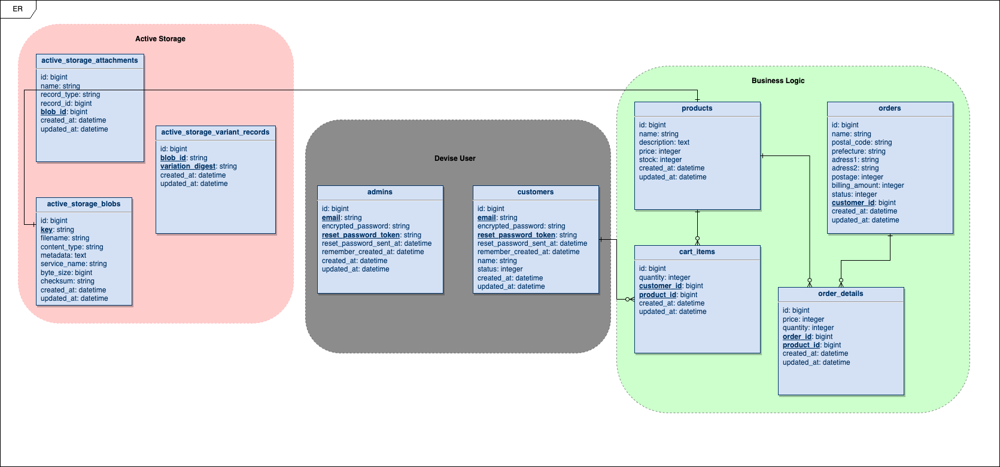

<p align="center">
    
</p>

<p align="center">


</p>

# Rails Ecommerce Application 🛍

### Gem

<details>
  <summary>一覧</summary>

- [devise * ユーザー認証用](https://github.com/heartcombo/devise)
- [stripe * Stripe決済](https://github.com/stripe/stripe-ruby)
- [aws-sdk-rails * AWS-SDK](https://github.com/aws/aws-sdk-rails)
- [bullet * N+1検知用](https://github.com/flyerhzm/bullet)
- [annotate * モデルのアノテーションコメント用](https://github.com/ctran/annotate_models)
- [rspec-rails * テストフレームワーク](https://github.com/rspec/rspec-rails)
- [capybara * システムテスト用](https://github.com/teamcapybara/capybara)
- [selenium-webdriver * システムテスト用](https://github.com/SeleniumHQ/selenium/tree/trunk/rb)
- [rubocop-rails * 自動フォーマット](https://github.com/rubocop/rubocop-rails)
- [capistrano * デプロイ用](https://github.com/capistrano/capistrano)

</details>

### Node

<details>
  <summary>一覧</summary>

- [tailwindcss * CSSフレームワーク](https://github.com/tailwindlabs/tailwindcss)

</details>

---

## ER図

<p align="center">
    
</p>

---

## インフラ構成図

<p align="center">
    
</p>

---

## プロジェクト詳細

### ディレクトリ構造

```
├── .github/
│   ├── workflows/              # Github Actions configuration files

├── app/
│   ├── controllers/            # Contains controller files for the application logic
│   ├── models/                 # Includes model files representing the data structures
│   ├── views/                  # Holds view templates for rendering web pages

├── config/
│   ├── routes.rb               # Defines the application's routing configuration
│   ├── credentials.yml.enc     # File for storing confidential information (e.g., API keys)

├── db/                         # Contains database schema and migration files

├── docs/                       # Stores documentation files for the project

├── spec/
│   ├── models/                 # Contains RSpec tests for models
│   ├── modules/                # Contains RSpec tests for modules
│   ├── requests/               # Contains RSpec tests for request/response handling
│   ├── support/                # Holds support files for RSpec configuration
│   ├── system/                 # Includes RSpec tests for system-level functionality

├── Capfile                     # Configuration file for Capfile
├── .rspec                      # Configuration file for RSpec test suite
├── .rubocop.yml                # Configuration file for the RuboCop code analyzer
├── docker-compose.yml          # Configuration file for Docker Compose
├── Dockerfile                  # Docker container build instructions
├── Gemfile                     # Lists project dependencies in RubyGems format
├── Gemfile.lock                # Lock file specifying exact dependency versions
├── yarn.lock                   # Lock file for Yarn package manager
```

### Git Flow

- `develop` - ローカル環境
- `release` - ステージング環境
- `main` - 本番環境

プルリクエストの流れ : `develop -> release -> main`

ブランチ命名規則 : 機能開発：`feature/hoge-issue#1`, バグ改修：`hotfix/hoge-issue#1`

---

### ローカル環境構築

### `.env`

```sh
cp .env.example .env
```

環境ファイルの編集

```dotenv
# ローカルのプロジェクト環境に合わせる
export COMPOSE_PROJECT_NAME=base
export POSTGRES_DB=base
export POSTGRES_USER=root
export POSTGRES_PASSWORD=password

# 警告表示を消す
THOR_SILENCE_DEPRECATION=true
```

暗号ファイルの編集 🔑

```sh 
EDITOR="cursor --wait" rails credentials:edit 
```

```yaml
  aws:
    access_key_id:
    secret_access_key:

  stripe:
    publishable_key:
    secret_key:
    endpoint_secret:

  gmail:
    email:
    app_password:

  db:
    password:
    hostname:
```

### `Docker`

#### イメージのビルドと立ち上げ:

```docker
docker-compose build --no-cache
docker-compose up -d
```

#### Webコンテナ内へのアクセス:

```docker
docker-compose run --rm web bash
```

マイグレーション実行

```sh
rails db:migrate
```

---

## 開発コマンド系

### `Bundle`

```sh
# モデル関連のファイルにアノテーションを記載
bundle exec annotate --models
# テストの実施（RSpec）
bundle exec rspec
bundle exec rspec spec/system/
# デプロイ
bundle exec cap production deploy
```

### `rubocop`

```sh
# フォーマットの静的解析
rubocop
# フォーマットの自動修正
rubocop --auto-correct-all
```
