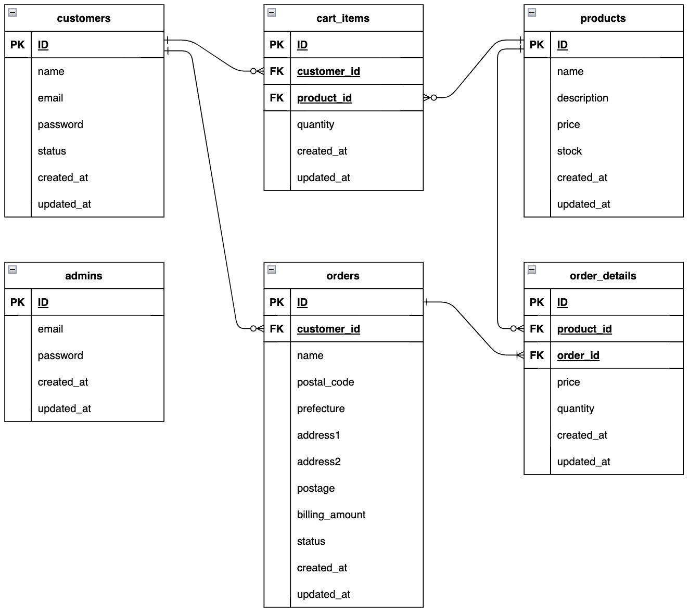

<p align="center">
    
</p>

<p align="center">


</p>

# Rails Ecommerce Application 🛍

### Customer Sample Page 🛒

<p align="center">
    
</p>

### Admin Sample Page ⚙️

<p align="center">
    
</p>

### Add Gem package 📦

<details>
  <summary>Using package list</summary>

- [devise]()
- [stripe]()
- [rspec-rails]()
- [factory_bot_rails]()
- [capybara]()
- [selenium-webdriver]()
- [webdrivers]()
- [rubocop]()
- [rubocop-rails]()
- [rubocop-performance]()

</details>

### Add Node Modules 📦

<details>
  <summary>Using module list</summary>

</details>

### teaching materials link 📚

https://zenn.dev/farstep/books/7f169cdc597ada

# Directory Structure 📁

```
.
├── .github/
│   ├── workflows/              # Github Actions configuration files
├── app/
│   ├── controllers/            # Contains controller files for the application logic
│   ├── models/                 # Includes model files representing the data structures
│   ├── views/                  # Holds view templates for rendering web pages
│   ├── services/               # Houses service classes and modules
│
├── config/
│   ├── routes.rb               # Defines the application's routing configuration
├── db/                         # Contains database schema and migration files
├── docs/                       # Stores documentation files for the project
│
├── spec/
│   ├── models/                 # Contains RSpec tests for models
│   ├── system/                 # Includes RSpec tests for system-level functionality
│
├── .rspec                      # Configuration file for RSpec test suite
├── .rubocop.yml                # Configuration file for the RuboCop code analyzer
├── docker-compose.yml          # Configuration file for Docker Compose
├── Dockerfile                  # Docker container build instructions
├── Gemfile                     # Lists project dependencies in RubyGems format
├── Gemfile.lock                # Lock file specifying exact dependency versions
├── yarn.lock                   # Lock file for Yarn package manager

```

# Infrastructure 🌐

continue...

# DB Structure ⎗

<p align="center">
    
</p>

### `.env`

create .env file to copy .env.example file. 

```sh
cp .env.example .env
```

update .env file content

```dotenv
export COMPOSE_PROJECT_NAME=ecommerce
export POSTGRES_DB=ecommerce
THOR_SILENCE_DEPRECATION=true
```

### `Docker`

#### Build everything:

```do
docker-compose build --no-cache
```

#### Access to Docker application containers

```sh
docker-compose run --rm web bash
```

#### Stopping everything:

```sh
docker-compose down
```

# Command ⌨️

### `rails`

```sh
rails hogehoge
```

### `rubocop`

setting file - .rubocop.yml

```sh
# Static analysis command
rubocop

# Auto fix command
rubocop --auto-correct-all
```

### `rspec`

```sh
bundle exec rspec
```

### `deploy` 📲

```sh
```